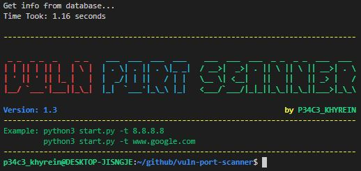

---

# Sosial Media
[](https://wa.me/6282214252455/)

# Software
[](https://www.python.org/download/releases/3.2/)

# Support
Vuln Port Scanner has tested it so far on:
* Kali Linux
* Parrot Security
* BlackArch
* Termux

# Instalation
```shell
wget https://raw.githubusercontent.com/p34c3-khyrein/vuln-port-scanner/main/start.py
```

# Running
## execute target
```shell
python3 start.py -t 8.8.8.8
```
## what's new
```shell
python3 start.py -w
```
## help
```shell
python3 start.py -h
```

# I also want to make you aware that:
* This was written for educational purpose and pentest only.
* The author will not be responsible for any damage ..!
* The author of this tool is not responsible for any misuse of the information.
* You will not misuse the information to gain unauthorized access.
* This information shall only be used to expand knowledge and not for
causing malicious or damaging attacks.
* Performing any hacks without written permission is illegal ..!
****
